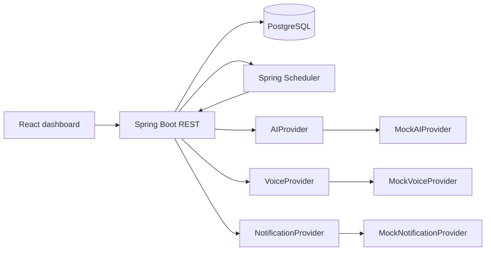
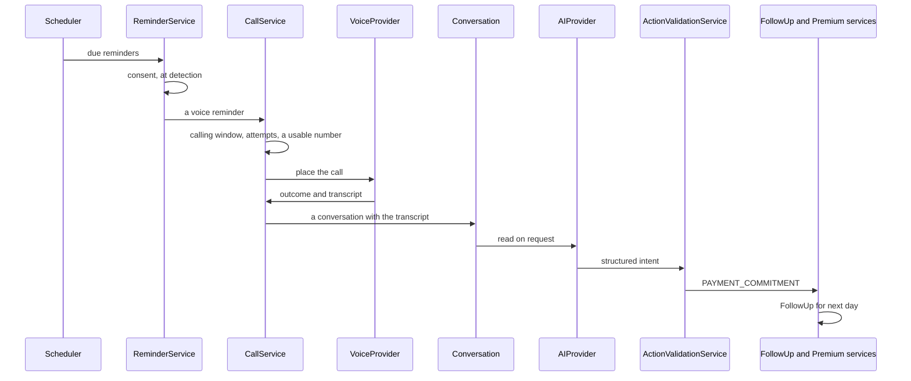

# Architecture

**Product:** Policy Pulse — AI-powered insurance agent management & customer engagement platform

Generic multi-tenant insurance CRM for agencies and independent agents. LIC is example data only — never hard-coded business logic.

## System context



## Modules (backend)

| Package | Responsibility |
| --- | --- |
| `auth` | Login, JWT |
| `users` | Users and roles |
| `organizations` | Tenants and reminder config |
| `customers` | Customer CRM, scoped to the caller's tenant |
| `policies` | Policies, scoped to the caller's tenant |
| `premiums` | Instalment schedules and recorded payments |
| `reminders` | Reminder entities, idempotent detection and per-tenant settings |
| `notifications` | In-app messages per user + provider abstraction |
| `ai` | AIProvider, intent, context, and the validation that bounds it |
| `voice` | Placing calls: the calling window, attempt limits, and what a call leaves behind |
| `conversations` | Calls and transcripts, written either by an agent or by a placed call |
| `followups` | Commitments, owned by the customer's own agent |
| `dashboard` | Aggregates and action-required, counted in the database |
| `audit` | Audit log writer |
| `reports` | CSV/report queries |
| `scheduler` | Hourly sweep, so each tenant is picked up after its own midnight |
| `common` | Errors, DTOs, pagination |
| `security` | JWT filter, RBAC helpers |

## Premium-commitment loop



AI never writes `PremiumPayment.status = PAID`. `PAYMENT_CONFIRMED` creates pending verification and a HumanTask.

A call is not retried for ever: past the tenant's attempt limit, or against a
number that cannot be dialled, the reminder is given up on and a HumanTask is
raised, so the work becomes somebody's rather than disappearing.

## Folder structure

```
backend/src/main/java/com/policypulse/...
frontend/src/pages/...
docs via README, LOCAL_DEVELOPMENT, DATABASE, SECURITY
```

## Dependencies

**Backend:** Spring Boot 3.3 Web, Data JPA, Security, Validation, Actuator, Flyway, PostgreSQL, JJWT, springdoc-openapi. Rate limiting is a small in-process fixed-window filter, not Bucket4j.

**Testing:** JUnit 5, Spring Boot Test, Testcontainers (real PostgreSQL, Flyway applied, `ddl-auto: validate`).

**Frontend:** React 18, TypeScript, Vite, Tailwind, React Router, Axios, Recharts.

## Implementation roadmap

Phases 1–12 as in the product plan: setup → auth/audit → customers → policies/premiums → reminders + in-app notify → dashboard → conversations/follow-ups → AI → voice → follow-up engine → email/SMS providers → seed/hardening.
