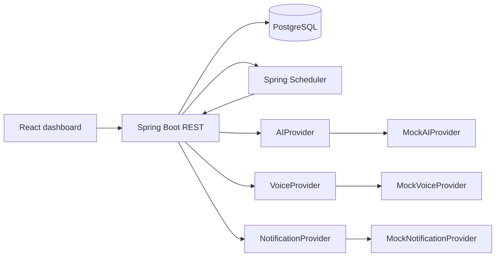
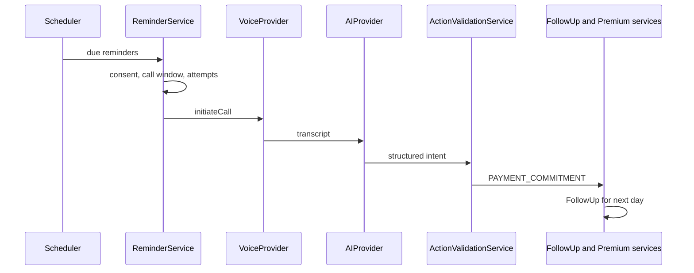

# Architecture

**Product:** AI-Powered Insurance Agent Management & Customer Engagement Platform

Generic multi-tenant insurance CRM for agencies and independent agents. LIC is example data only — never hard-coded business logic.

## System context



## Modules (backend)

| Package | Responsibility |
| --- | --- |
| `auth` | Login, JWT |
| `users` | Users and roles |
| `organizations` | Tenants and reminder config |
| `customers` | Customer CRM |
| `policies` | Policies |
| `premiums` | PremiumPayment records |
| `reminders` | Reminder entities and detection |
| `notifications` | In-app + provider abstraction |
| `ai` | AIProvider, intent, context, validation |
| `voice` | VoiceProvider, mock/Twilio stub |
| `conversations` | Calls, transcripts, messages |
| `followups` | Commitments and HumanTask |
| `dashboard` | Aggregates and action-required |
| `audit` | Audit log writer |
| `reports` | CSV/report queries |
| `scheduler` | Idempotent jobs |
| `common` | Errors, DTOs, pagination |
| `security` | JWT filter, RBAC helpers |

## Premium-commitment loop



AI never writes `PremiumPayment.status = PAID`. `PAYMENT_CONFIRMED` creates pending verification and a HumanTask.

## Folder structure

```
backend/src/main/java/com/insureplatform/...
frontend/src/pages/...
docs via README, LOCAL_DEVELOPMENT, DATABASE, API, AI_ARCHITECTURE, VOICE, SECURITY, DEPLOYMENT
```

## Dependencies

**Backend:** Spring Boot 3.3 Web, Data JPA, Security, Validation, Actuator, Flyway, PostgreSQL, JJWT, springdoc-openapi, Bucket4j (rate limit).

**Frontend:** React 18, TypeScript, Vite, Tailwind, React Router, Axios, Recharts.

## Implementation roadmap

Phases 1–12 as in the product plan: setup → auth/audit → customers → policies/premiums → reminders + in-app notify → dashboard → conversations/follow-ups → AI → voice → follow-up engine → email/SMS providers → seed/hardening.
